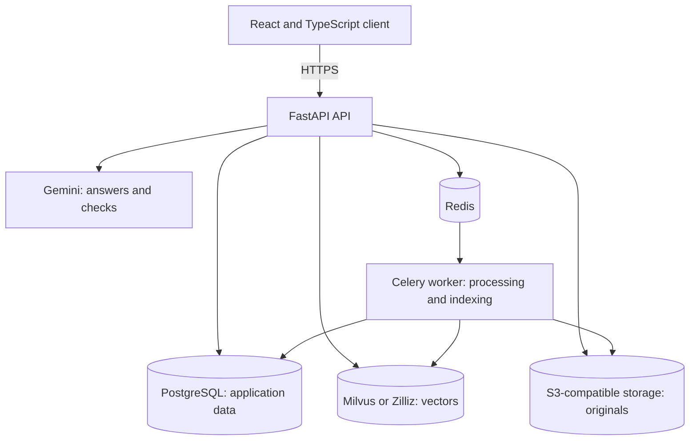
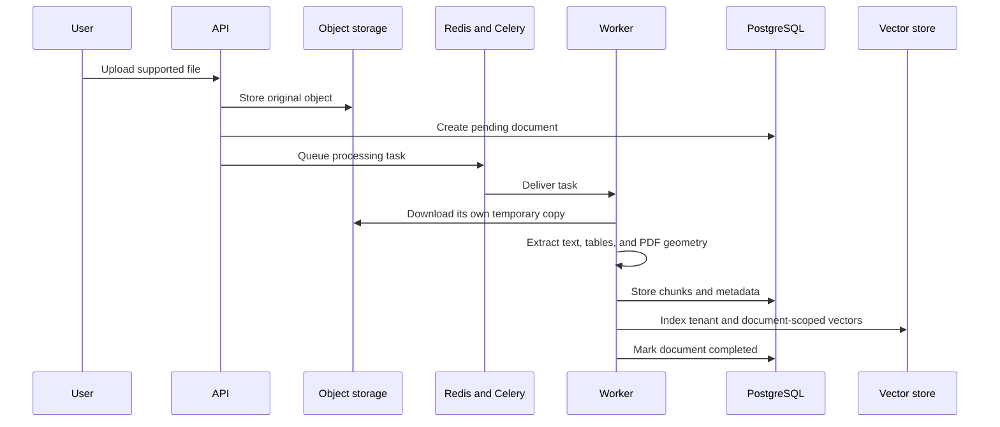
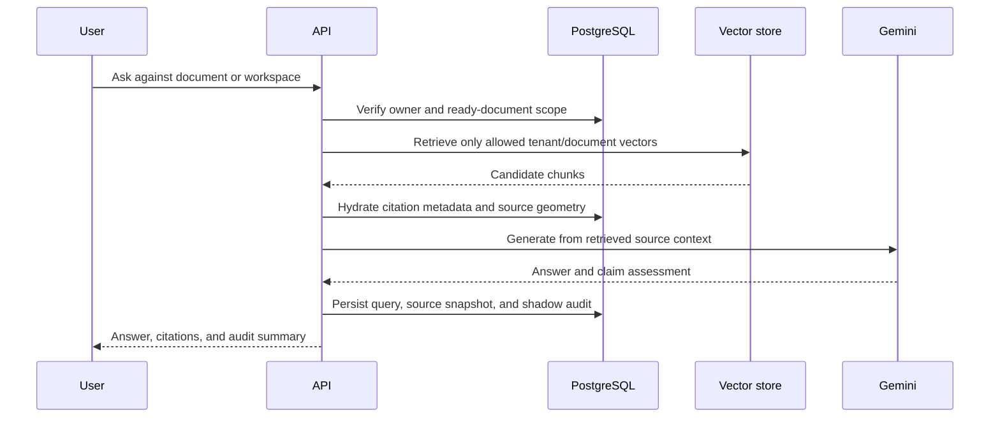
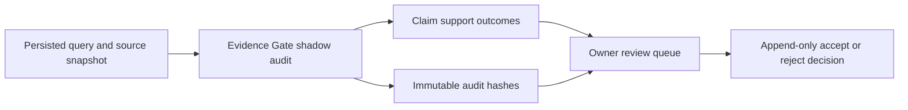

# InsightDocs Architecture

InsightDocs is an evidence-first document application. Its architecture favors explicit retrieval scope, inspectable citations, owner isolation, and operational safety over open-ended autonomous behavior.

## Runtime topology

| Component | Responsibility |
| --- | --- |
| Browser client | Authentication UI, document library, Evidence Workspaces, source viewing, history, and review actions. |
| FastAPI API | Authentication, ownership checks, upload handoff, query orchestration, history, Evidence Gate persistence, and review APIs. |
| Celery worker | Parsing, OCR where configured, chunking, embedding, vector indexing, and document state transitions. |
| PostgreSQL | Application records, document/chunk metadata, query history, audit runs, and append-only review decisions. |
| Milvus or Zilliz | Retrieval vectors constrained by tenant and document scope. |
| S3-compatible storage | Original uploaded files. The API issues short-lived owner-checked URLs for viewing. |
| Redis | Celery broker/result backend and rate-limit storage. |

A user may provide an encrypted BYOK Gemini key. A configured system key is an optional fallback. Gemini is never the source of record for ownership, document state, citations, or review decisions.

## Ingestion lifecycle

The upload API stores the original file before it queues the worker. A worker downloads its own temporary copy, so processing does not depend on an API container’s local filesystem.

A document becomes queryable only after processing succeeds. The UI calls this **Ready**; the persisted state is `completed`. Queued, processing, and failed documents remain unavailable as evidence.

## Query and evidence lifecycle

### Scope rules

- Every vector search is constrained by `user_id`.
- A single-document query validates ownership and adds that `document_id` to retrieval.
- A workspace query resolves the owner’s explicitly selected completed documents and passes a document allow-list.
- An empty workspace, or one without ready documents, returns an error. It never falls back to the user’s full library.
- A conversation ID cannot be reused across different workspaces.

### Cancellation

The browser may cancel an in-flight request. The API checks for a disconnected client after generation and before persistence. When a disconnect is observed, it returns `499` and does not save the query or Evidence Gate record. Gemini generation is non-streaming, so cancellation cannot revoke a request already sent to the provider.

## Citations and source inspection

Retrieved vector results are hydrated from PostgreSQL before they are returned. A source reference carries document, page, chunk, section, similarity score, and spatial geometry when available.

| Source type | Citation behavior |
| --- | --- |
| New text-based PDF ingestion | Stores separated line/region boxes. The viewer renders one overlay per region. |
| Legacy PDF ingestion | Retains the stored single bounding box. Re-ingest for multi-region geometry. |
| Scanned or OCR-only document | Can provide text evidence, but may not have spatial PDF highlights. |

## Evidence Gate and review

Evidence Gate is a shadow-mode assessment. It records whether answer claims are supported by the selected source snapshot when verification is available. It does not block the answer, search the web, declare universal truth, or make a decision for the user.

Review decisions are owner-scoped and append-only. A compare-and-swap `review_version` prevents a stale accept/reject action from silently overwriting another decision.

## Security and ownership boundaries

| Boundary | Enforcement |
| --- | --- |
| Authentication | JWT-protected user data routes. |
| Document access | Owner filter on document, workspace membership, history, audit, review, and presigned file URL operations. |
| Retrieval | Tenant filter plus direct-document or workspace allow-list. |
| BYOK | Encrypted at rest; decrypted only for an authorized request; never returned through the API. |
| Storage access | Presigned original-file URLs are issued only after ownership checks and expire quickly. |
| Browser origin | Explicit allowed-origin configuration. |

## Deployment boundary

API and worker are separate services. They must share compatible PostgreSQL, Redis, storage, vector, encryption, and retrieval-mode configuration. In constrained deployments, `EMBEDDING_MODE=sparse` avoids importing local dense embedding, reranking, and PyTorch models.

`scripts/start_api.sh` runs `alembic upgrade head` before Uvicorn starts. A migration failure stops the API; a schema-mismatched service must not report itself healthy.

See [DEPLOYMENT.md](DEPLOYMENT.md) for the release topology, configuration placement, and verification procedure.
