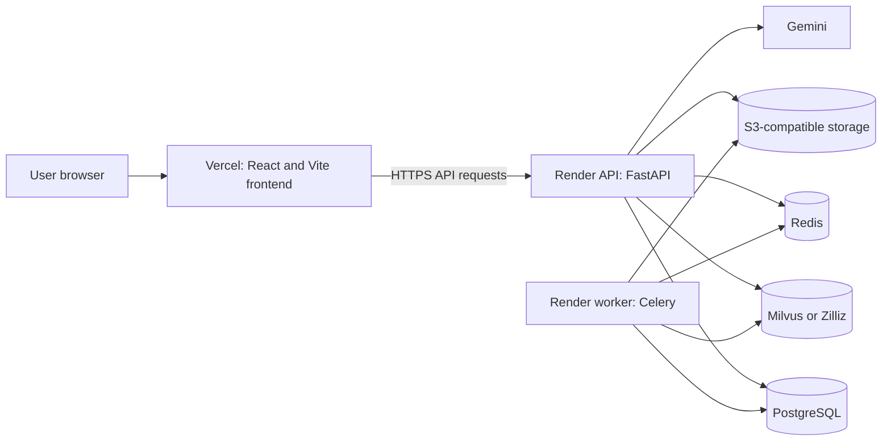
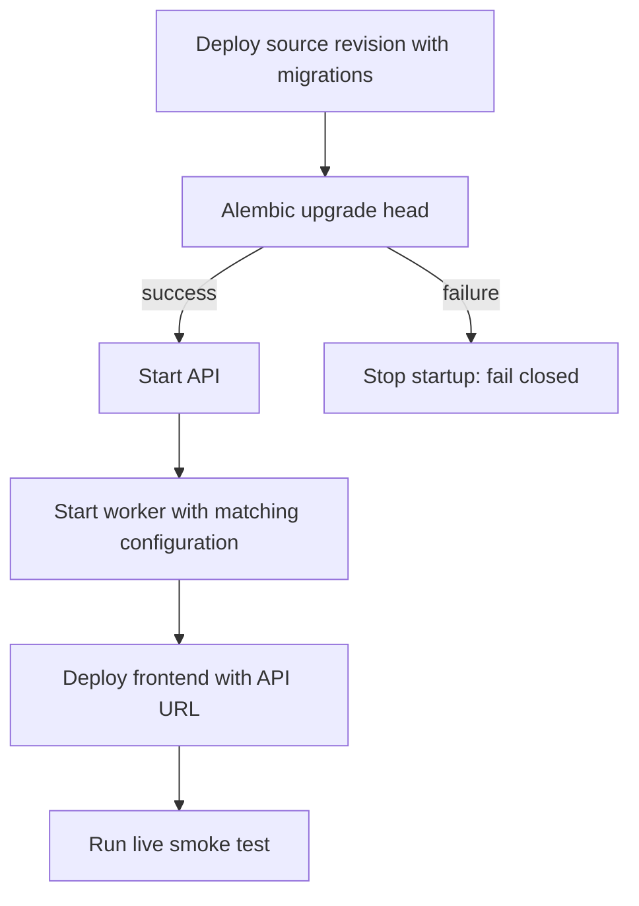
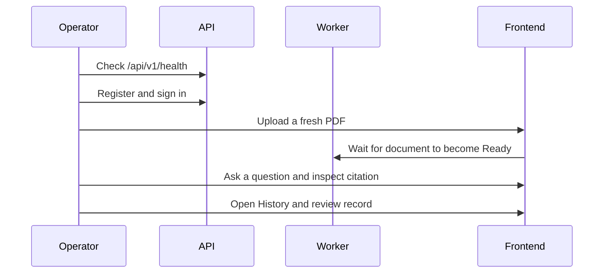

# InsightDocs Deployment Guide

This guide deploys the frontend, API, worker, database, vector search, queue, and object storage as separate responsibilities. It uses Render and Vercel as concrete examples; equivalent providers are acceptable when they meet the same boundaries.

## Deployment topology

The API and worker must use the same database, Redis, object-storage, vector, encryption, and retrieval-mode configuration. The frontend receives only `VITE_API_BASE_URL`; it must never receive server or provider secrets.

## Before creating services

Provision these services and retain their connection values in your deployment secret manager.

| Service | Required role | Example provider |
| --- | --- | --- |
| PostgreSQL | Users, documents, chunks, history, audits, reviews | Render Postgres, Neon, Supabase |
| Redis | Celery broker/result backend and rate limiting | Render Redis, Upstash |
| Milvus or Zilliz | Tenant-scoped vector retrieval | Zilliz Cloud, Milvus |
| S3-compatible storage | Original uploaded documents | S3, Cloudflare R2, Backblaze B2 |
| API and worker hosting | FastAPI and Celery services | Render, Railway |
| Frontend hosting | Vite single-page app | Vercel |

## Release sequence

Do not deploy an API source revision that lacks the migration revision recorded by the database. Do not bypass a mismatch with `alembic stamp` or by deleting `alembic_version`.

## 1. Deploy the API

Create a Render **Web Service** from this repository.

| Setting | Value |
| --- | --- |
| Runtime | Docker |
| Dockerfile | `Dockerfile` |
| Build command | Leave empty; Dockerfile installs `requirements-prod.txt` into `/opt/venv`. |
| Start command | Leave empty; image CMD runs `bash scripts/start_api.sh`. |
| Memory-constrained plan | Set `EMBEDDING_MODE=sparse`. |

The start script runs migrations before Uvicorn. If migration fails, the service must fail instead of binding a healthy port against an unknown schema.

## 2. Deploy the worker

Create a Render **Background Worker** from the same repository.

| Setting | Value |
| --- | --- |
| Runtime | Docker |
| Dockerfile | `Dockerfile.worker` |
| Build command | Leave empty. |
| Start command | Leave empty; image CMD runs `bash scripts/start_worker.sh`. |

The worker performs parsing, OCR where configured, chunking, and vector indexing. A queued document will not become Ready without it.

## 3. Configure server environment variables

Set these on **both API and worker** unless marked otherwise. Copy the exact variable names from [`.env.example`](.env.example).

| Group | Variables |
| --- | --- |
| Application | `APP_ENV=production`, `DEBUG=false`, `SECRET_KEY`, `ALLOWED_ORIGINS` |
| Retrieval | `EMBEDDING_MODE=sparse` for 512 MB services, `MILVUS_URI`, `MILVUS_TOKEN`, `MILVUS_COLLECTION`, `MILVUS_DIM` |
| Data and queue | `DATABASE_URL`, `REDIS_URL`, `CELERY_BROKER_URL`, `CELERY_RESULT_BACKEND` |
| Object storage | `S3_ENDPOINT`, `AWS_ACCESS_KEY_ID`, `AWS_SECRET_ACCESS_KEY`, `S3_BUCKET_NAME`, `AWS_DEFAULT_REGION` |
| Gemini | `GEMINI_MODEL=gemini-3.6-flash`, `GEMINI_MODEL_FALLBACKS=gemini-3-flash-preview`; `GEMINI_API_KEY` only when using a system-level fallback in addition to BYOK. |

`SECRET_KEY` must be identical for API and worker so an authorized worker/API operation can decrypt stored BYOK values. Never put these values in the Git repository, frontend variables, or browser build output.

### GitHub Actions worker alternative

`.github/workflows/process-celery-queue.yml` can run one Celery consumer for up to twelve minutes every fifteen minutes, or on manual dispatch. It is a lower-cost alternative to a permanent worker, but a newly uploaded document may wait up to fifteen minutes unless an operator triggers the workflow.

Add the same server configuration as GitHub Actions repository secrets. Include `SECRET_KEY`, database/Redis/Milvus/storage variables, and optional `GEMINI_API_KEY` if a system-level fallback is used.

## 4. Deploy the frontend

Create a Vercel project from this repository.

| Setting | Value |
| --- | --- |
| Root directory | `frontend` |
| Framework | Vite |
| Required environment variable | `VITE_API_BASE_URL=https://your-api-host/api/v1` |

Add the final Vercel URL to the API and worker `ALLOWED_ORIGINS` list. `frontend/vercel.json` handles SPA routing and configured security headers.

## 5. Verify a release

Use this release checklist:

- [ ] `alembic current` reports `d8e4f1a2b903` or a later revision.
- [ ] API health returns healthy.
- [ ] Worker receives and completes a document task.
- [ ] A fresh PDF becomes Ready and shows citation highlights.
- [ ] A workspace query searches only its selected ready documents.
- [ ] History reopens a routed document or workspace conversation.
- [ ] Review queue loads and rejects a stale decision with a visible conflict.
- [ ] Stop cancels an active query without persisting a cancelled answer when the disconnect is observed.

## Troubleshooting

| Symptom | First check | Correct response |
| --- | --- | --- |
| Browser CORS failure | `ALLOWED_ORIGINS` | Add the exact frontend origin, without path segments. |
| Query returns `503` | Milvus/Zilliz connectivity | Verify `MILVUS_URI`, `MILVUS_TOKEN`, collection settings, and network access. |
| Upload succeeds but never becomes Ready | Worker and Redis logs | Confirm worker is running and both services use the same Redis configuration. |
| PDF viewer cannot load | Presigned URL and storage endpoint | Ensure the object-storage endpoint is browser reachable and configured correctly. |
| API fails on startup | Migration log | Confirm source contains the recorded migration, compare `alembic heads` and `alembic current`, then deploy the matching revision. |
| BYOK fails after deployment | `SECRET_KEY` mismatch | Set the same `SECRET_KEY` on API and worker; do not rotate it without a credential migration plan. |

## Operational notes

- API migrations run before Uvicorn begins. For multiple API instances, use a one-off migration job before rolling instances.
- Production logs are JSON when `APP_ENV=production`.
- Object-storage URLs are short-lived and owner-checked before they are issued.
- Existing PDFs retain legacy single-region highlights until they are re-ingested; use a fresh PDF smoke test for multi-region highlights.

For runtime/data flow, see [ARCHITECTURE.md](ARCHITECTURE.md). For environment variable descriptions, see [`.env.example`](.env.example). For the current supported product boundary, see [PROJECT_STATUS.md](PROJECT_STATUS.md).
